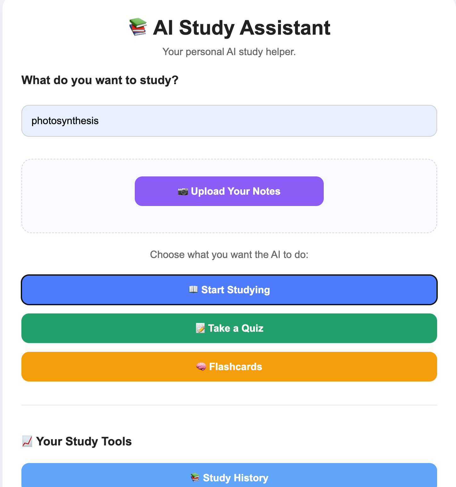

# 📚 AI Study Assistant

AI Study Assistant is a web app that helps students learn and practice different subjects using AI. It can create study lessons, quizzes, flashcards, and help students ask questions about what they are learning.

## 🚀 Project Highlights

- Built a full-stack web app using JavaScript and Node.js
- Connected the app to the OpenAI API
- Created AI-generated lessons, quizzes, and flashcards
- Added an AI tutor for asking questions
- Added note upload features for studying
- Added study history, progress tracking, goals, and streaks
- Used Git and GitHub for version control

## ✨ Features

- 📖 AI-generated study lessons
- 📝 AI-generated quizzes
- 🧠 AI-generated flashcards
- 📷 Upload notes and study from them
- 💬 Ask the AI questions about your lesson
- 📚 Study history
- 📊 Progress tracking
- 🎯 Study goals
- 🔥 Study streaks

## 🛠️ Technologies

- HTML — structure and layout
- CSS — styling and design
- JavaScript — app functionality
- Node.js — backend server
- Express — API routes and server handling
- OpenAI API — AI-generated study content
- Git & GitHub — version control

## 🚀 How It Works

1. Enter a topic you want to study.
2. Choose Study, Quiz, or Flashcards.
3. The app sends the topic to the AI.
4. The AI creates study material based on that topic.
5. Ask the AI questions about the lesson or practice with a quiz.
6. Track your study history, progress, goals, and streaks.

## 💻 Run Locally

1. Clone the repository.
2. Install the required packages with `npm install`.
3. Create a `.env` file and add your OpenAI API key.
4. Start the server with `node server.js`.
5. Open `http://localhost:3000` in your browser.

## 🔐 Security

The OpenAI API key is stored in a local `.env` file and is not included in the GitHub repository.

A `.gitignore` file is used to prevent private files and dependencies from being uploaded.

## 👨‍💻 Author

Nizar

## 📸 App Screenshot

